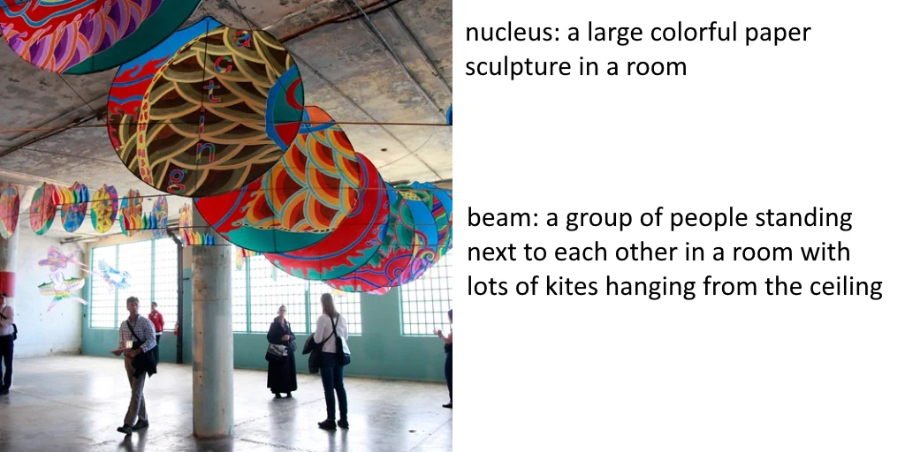
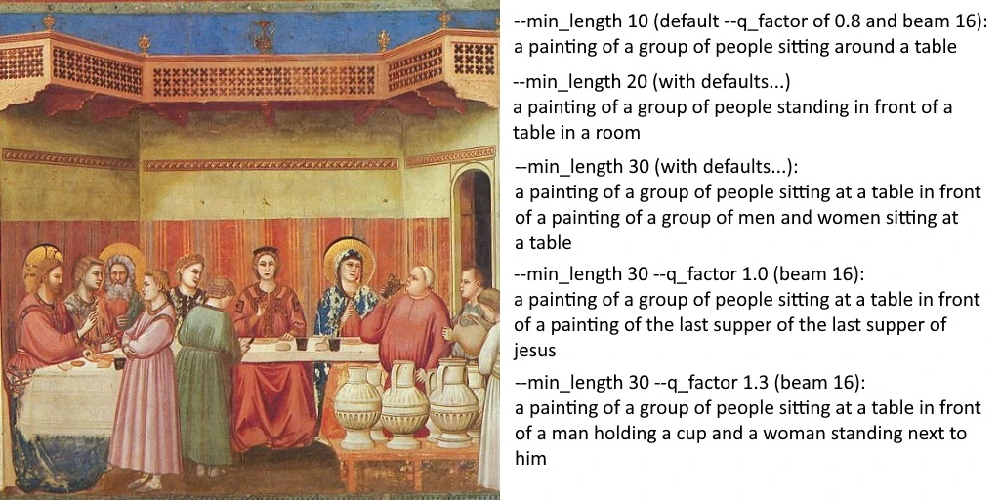

# Automatic captioning

Automatic captioning uses Salesforce's BLIP to automatically create a clean sentence structure for captioning input images before training.

This requires an Nvidia GPU, but is not terribly intensive work.  It should run fine on something like a 1050 Ti 4GB. 

I suggest using [Birme](https://www.birme.net/?target_width=512&target_height=512&auto_focal=false&image_format=webp&quality_jpeg=95&quality_webp=99) to crop and resize first, but there are various tools out there for this.  I strongly suggest making sure to crop well for training!  It's best to crop to square first because you do not want to caption things that are later removed by cropping.

## Execute

Place input files into the /input folder

    python scripts/auto_caption.py

Files will be **copied** and renamed to the caption as the file name and placed into /output. 

## Additional command line args:

### --img_dir

Changes the default input directory to read for files.  Default is /input

    python scripts/auto_caption.py --img_dir x:/data/my_cropped_images

### --out_dir

Changes the default output directory.  Default is /output

    python scripts/auto_caption.py --out_dir x:/data/ready_to_train

### --format

"filename" or "mrwho"

"filename" will simply name the file the caption .EXT and, if needed, add _n at the end to avoid collisions, for use with EveryDream trainer or Kane Wallmann's dream booth fork.  This is the default behavior if --format is not set.

"mrwho" will add \[number\]@ as a prefix for use with MrWho's captioning system (ex. JoePenna dream both fork) which uses that naming standard to avoid file name collisions.

    python scripts/auto_caption.py --format "mrwho"

## Tweaks

You may find the following setting useful to deal with issues with bad auto-captioning.  Start with defaults, and if you have issues with captions that seem inaccurate or reptitious, try some of the following settings. 

### --nucleus

Uses an alternative "nucleus" algorithm instead of the default "beam 16" algorithm.  Nucleus produces relatively short captions but reliably absent of repeated words and phrases, comparable to using beam 16 which can be adjusted further but may need more tweaking. 0.3 to 3 seem to produce sensible prompts.

    python scripts/auto_caption.py --nucleus

Additional captions for above with nucleus:

nucleus q_factor 9999: *"a number of kites painted in different colors in a ceiling"*

nucleus q_factor 200: *"a group of people waiting under art hanging from a ceiling"*

nucleus q_factor 0.8: *"several people standing around with large colorful umbrellas"*

nucleus q_factor 0.01: *"people are standing in an open building with colorful paper decorations"*

nucleus q_factor 0.00001: (same as above)

### --q_factor

An adjustment for the algorithm used. 

For the default beam 16 algorithm it limits the ability of words and phrases to be repeated.  Higher value reduces repeated words and phrases.  0.6-1.3 are sensible values for beam 16.  Default is 0.8 and works well with the defaulted value min_length == 24.  Consider using higher values if you use a min_length higher than 24 with beam 16.

For nucleus (--nucleus), it simply changes the opinion on the prompt and does not impact repeats.  Values ranging from 0.01 to 200 seem sensible and default of 0.8 usually works well.

### --min_length

Adjusts the minimum length of prompt, measured in tokens.  **Only applies to beam 16.**  Useful to adjust along with --q_factor to keep it from repeating.

Default is 24.  Sensible values are 15 to 30, max is 48.  Larger values are much more prone to repeating phrases and should be accompanied by increasing --q_factor to avoid repeats.

    python scripts/auto_caption.py --min_length 20

If you continue to both increase min_length and q_factor you start to get oddly specific prompts. For example using the above image:

--q_factor 1.9  --min_length 48: 

*"a painting of a group of people sitting at a table in a room with red drapes on the walls and gold trimmings on the ceiling, while one person is holding a wine glass in front of the other hand"*